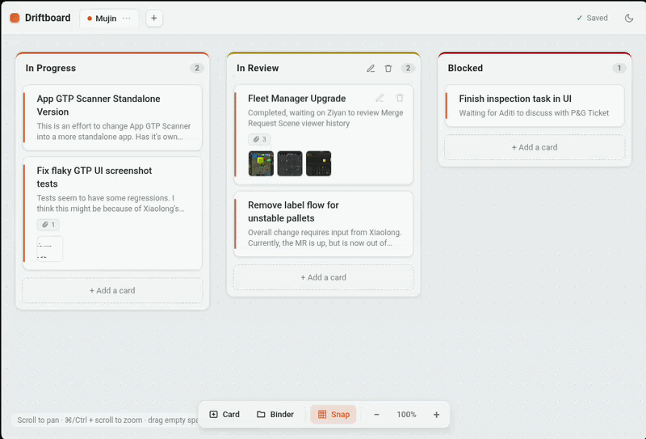
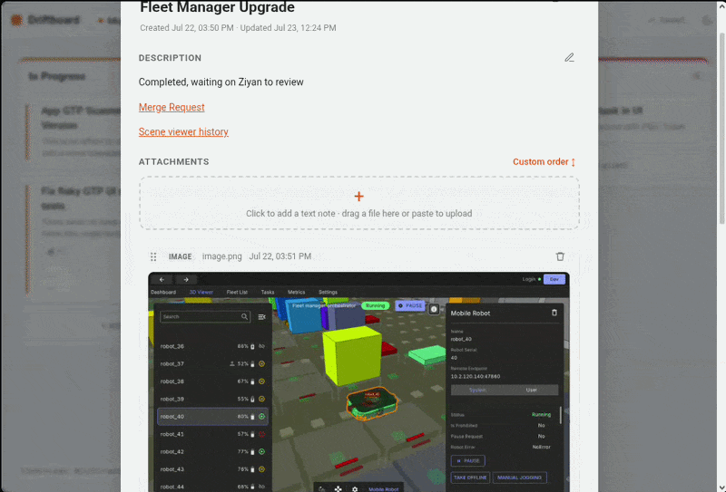

<h1 align="center">🗂️ Driftboard</h1>

<p align="center">
  <b>An infinite-canvas to-do board.</b> Float cards anywhere, file them into colorful binders,<br>
  and drop images, videos, links, and notes onto any card.
</p>

<p align="center">
  <a href="https://mitchellaidant.github.io/driftboard/"></a>
</p>

<p align="center">
  
  
</p>

<p align="center">
  
</p>

---

## 🎡 What you can do

### Drag everything, with a bit of bounce
Grab a card and move it wherever you like it; drop it into a
binder or leave it floating on the canvas.

### Rich cards with attachments
Open any card for a title, a description, and a stack of attachments —
**text notes, links, images, videos, and files**. Drag a file to the binder,
or just paste (⌘/Ctrl+V) straight onto the card. Text uses markdown formatting!

### Reorder attachments by hand
Drag any attachment by its grip: a lifted preview follows your cursor and an
**orange placeholder** shows exactly where it'll land, while the rest slide out of
the way.

<p align="center"></p>

---

## ✨ Try it now — no install

**[▶ Open the live demo →](https://mitchellaidant.github.io/driftboard/)**

The demo runs **entirely in your browser** — there's no server and nothing is
uploaded anywhere. Your board (and any files you drop in) are saved **on your own
machine** in the browser's local storage, which can be cleared, so DO NOT use the demo
for your personal use. Instead, [Run it locally](#-run-it-locally).

---

## 🧭 The tour

**Canvas**
- **Pan** — drag empty space, or scroll (two-finger on a trackpad).
- **Zoom** — ⌘/Ctrl + scroll, or the `+` / `−` / `100%` controls. `100%` resets the view.

**Boards** (the tabs up top)
- **+** makes a new empty board and opens it.
- **Double-click a tab** to rename it; the **⋯** menu also has Rename / Delete.

**Binders & cards**
- Add a **binder** or a floating **card** from the bottom toolbar; a binder also
  has its own *+ Add a card*.
- **Move a card** by dragging — into a binder to file it, or onto open canvas to
  let it float. **Move a binder** by its title bar.
- **Edit a binder** — double-click it to rename, pick an accent **color**, and add
  a description shown under its title.
- **Open a card** — click it. The title saves on blur; edit the description with
  the ✏ pencil (or double-click it) and click away to save.

**Attachments**
- The big **+**: click for a markdown note, or drag a file / paste to upload.
  Dropping a link adds it as a URL. New items land at the top (or the bottom in
  oldest-first order) and scroll into view.
- The sort button cycles **Newest → Oldest → Custom**; dragging to reorder switches
  to Custom automatically.

**Appearance**
- **Light / dark** toggle at the top-right (remembered per browser).
- **Snap to grid** toggle so cards and binders line up as you drag.

**Undo**
- Deleting a card or binder is **undoable** — the toast's **Undo** button or
  **⌘/Ctrl+Z**. The last 40 deletions come back, even after a restart.

---

## 💻 Run it locally

Running locally gives you the **full app with a small Node server** that saves your
board as real files on disk (great for backups) instead of in the browser.

```sh
git clone https://github.com/mitchellaidant/driftboard.git
cd driftboard
npm install
npm start
```

Then open **http://localhost:4321**. Use a different port with `PORT=5000 npm start`.

---

## 💾 Where your stuff is saved

| | Live demo (browser) | Local (`npm start`) |
|---|---|---|
| Storage | IndexedDB + Blobs, in your browser | JSON + files on disk under `data/` |
| Leaves your machine? | No | No |
| Survives clearing site data? | No | Yes |
| Good for | trying it out | real, backed-up use |

For the local version, everything lives in `data/` (`board.json` plus an
`uploads/` folder of your media) — copy that folder to back up or move everything.

---

## 🧩 One codebase, two modes

Both versions are the **same frontend** in `docs/`. It talks to storage through a
single function, so it can run against the Node backend *or* a browser-only backend
with no other changes:

- **Server mode** — `server.js` (Express) serves `docs/` and stores data on disk.
- **Demo mode** — `docs/demo-api.js` reimplements the same API against IndexedDB,
  so the site works as a static page (that's how GitHub Pages hosts it).

<details>
<summary>Publishing the demo to GitHub Pages</summary>

`docs/` is already static-ready. In the repo, go to **Settings → Pages → Build and
deployment → Source: Deploy from a branch**, pick **`main`** and the **`/docs`**
folder, and save. Pages serves it at `https://<user>.github.io/<repo>/`.
</details>
